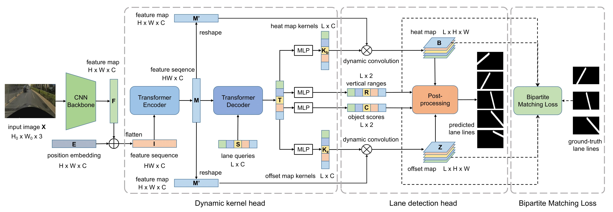

# CondLSTR

gpu vram 2.8기가 이슈 , transformer 기반 model 학습에 무리가 있다고 판단

   

# 수정사항

1. train.py
2. trainer.py (engine)
3. resnet10 추가 및 init.py lane 부분에 추가
4. preprocess 텐서 matrix 크기에 맞게 변경

- vram 부족 이슈로, gpu 구비 후 재개
